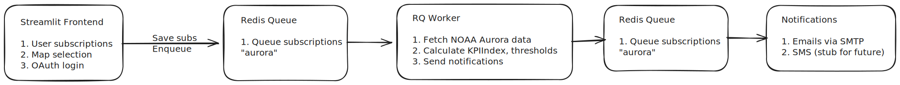

# 🌌 AuroraPulse

**Catch the aurora before it fades - alerts that keep you in the glow!** 

Aurora Pulse is a **real-time aurora alert system** built with **Streamlit**. Users can subscribe to aurora notifications for specific locations and thresholds, and receive alerts via **email** when aurora activity meets their criteria. The app is designed with **scalable architecture**, **pub/sub background processing**, and **geospatial intelligence** for accurate nearest-neighbor aurora calculations.

---

## 🎬 Demo

<iframe width="1071" height="602" src="https://www.youtube.com/embed/EP0qgu7KHCY" title="AuroraPulse: Real-Time Aurora Alerts for Chasing the Northern Lights with Geospatial Intelligence!" frameborder="0" allow="accelerometer; autoplay; clipboard-write; encrypted-media; gyroscope; picture-in-picture; web-share" referrerpolicy="strict-origin-when-cross-origin" allowfullscreen></iframe>

**YouTube Link:** https://youtu.be/EP0qgu7KHCY

---

## ✨ Features

- **Real-time Aurora Data**: Fetches latest aurora oval data from [NOAA Data API](https://www.swpc.noaa.gov/content/data-access) and caches it for efficiency.
- **Geospatial Intelligence**:
  - Finds nearest aurora points for user locations using **Haversine distance** and **BallTree**.
  - Supports custom intensity thresholds for alerts.
- **User Subscriptions & Notifications**:
  - Users can save multiple subscriptions.
  - Alerts are sent via **HTML-rich email** notifications.
- **Background Processing**:
  - Uses **Redis + RQ (Redis Queue)** for background tasks.
  - Ensures **non-blocking** alert checks.
  - Avoids sending alerts too frequently (rate-limiting by `MIN_ALERT_GAP`).
- **OAuth Integration**:
  - **Google SSO** for secure authentication.
  - Session management and personalized greetings.
- **Scalable Architecture Design Decisions**:
  - **Redis + RQ over APScheduler**: 
    APScheduler runs tasks in-process, which can block the Streamlit app for multiple users. Redis + RQ allows **distributed workers**, retries, and fault tolerance.
  - **Pub/Sub Pattern**: Background worker subscribes to the "aurora" queue, enabling scalable notifications to many users.
  - **Streamlit caching**: Aurora data and map computations are cached for **performance optimization**.
- **Extensible Notification System**:
  - Email support with SMTP (configurable).
  - SMS notification stub for future integration.

---

## 🏗 Architecture Overview



**Key design decisions**:

- **Redis + RQ**: Enables asynchronous, distributed task execution, retries, and future horizontal scaling.
- **SQLite for dev / Postgres recommended for prod**: Simple local testing, but ready for production-grade DB.
- **Streamlit caching**: Reduces repeated API calls and heavy computation.
- **Haversine + BallTree**: Efficient nearest-neighbor queries for geospatial aurora intensity mapping.
- **Pub/Sub Pattern**: Decouples background processing from frontend requests.

---
## 🛠️ Tech Stack

- **Python 3.12+**
- **Streamlit** for the web UI
- **Folium** for interactive maps
- **SQLite** for storing subscriptions
- **Redis + RQ** for background jobs and task queue
- **scikit-learn** for nearest-neighbor calculations
- **Loguru** for structured logging
- **NOAA OVATION API** for real-time aurora data
- **SMTP** for sending HTML email notifications

---

## 📦 Project Structure

```
aurora-pulse/
├── src/
│   ├── backend/
│   │   ├── config.py
│   │   ├── db.py                   # SQLite DB setup & subscription management
│   │   ├── fetch_data.py           # Fetch aurora data & caching
│   │   ├── nearest_neighbour.py    # Distance calculations, threshold checks
│   │   ├── notifier.py             # Email/SMS notifications
│   │   ├── redis_handler/
│   │   │   ├── redis_conn.py       # Redis connection setup
│   │   │   ├── rq_tasks.py         # RQ task definitions
│   │   │   └── rq_worker.py        # RQ worker to process background jobs
│   │   ├── simple_apscheduler.py   # APScheduler setup (deprecated)
│   ├── frontend/
├── tests/                          # Unit tests for backend modules
│
├─ main.py                          # Streamlit app entrypoint
├─ pyproject.toml                   # Python project and dependencies
├─ aurora_data.json                 # Cached aurora data
├─ secrets.toml                     # Template for secrets configuration
├─ Dockerfile                       # Docker Image setup
├─ docker-compose.yml               # Docker Compose setup
└─ README.md
```

---

## 🚀 Installation

### Prerequisites
- Python ≥ 3.12
- [uv](https://pypi.org/project/uv/) (for package management)
- Redis (local or remote)
- SMTP email account (Gmail / SendGrid / SES)

### Clone the repo:
```bash
git clone https://github.com/shreayan98c/AuroraPulse.git
cd AuroraPulse/aurora-pulse
```

### Install dependencies:

```bash
uv sync
```

---

## ⚙️ Configuration
Secrets: Fill in your credentials and place them in `.streamlit/secrets.toml`.
```toml
[auth]
redirect_uri = "http://localhost:8501/oauth2callback"
cookie_secret = "<your_secret_here>"
client_id = "<your_google_client_id>"
client_secret = "<your_google_client_secret>"
server_metadata_url = "https://accounts.google.com/.well-known/openid-configuration"

[email]
smtp_server = "smtp.gmail.com"
smtp_port = 587
sender_email = "<your_email_here>"
app_password = "<your_app_password_here>"
```

## 🖥️ Running Locally
### Start Redis server
Start a local Redis server or connect to a remote Redis instance.
```bash
redis-server
```
Or connect to a cloud Redis instance using REDIS_URL env variable.

### Start RQ Worker
In a separate terminal, start the RQ worker to process background jobs:
```bash
uv run python -m src.backend.redis_handler.rq_worker
```

### Run the Streamlit app
In another terminal, start the Streamlit app:
```bash
uv run streamlit run main.py
```
Open your browser at http://localhost:8501 to start using the app.

---

## 🧪 Testing
All components are covered by unit tests:
```bash
uv run pytest tests/ --maxfail=1 -v
```

---

## 🗄 Database
- Uses SQLite by default (DB_PATH in config.py).
- For production, migrate to PostgreSQL.
- Tables:
    - subscriptions: stores user info, location, threshold, and last alert timestamp.

---

## 📡 Aurora Data
- Aurora oval data fetched from NOAA OVATION API.
- Cached for 5 minutes using @st.cache_data.
- Stored locally in aurora_data.json for fast retrieval.

---

## 🛰 Geospatial Calculations
- Uses Haversine distance for great-circle computation.
- BallTree from scikit-learn for fast nearest-neighbor queries.
- Efficiently finds closest aurora point to a user’s selected coordinates.

---

## 📧 Notifications
- Email notifications sent via SMTP with HTML formatting.
- Alerts respect MIN_ALERT_GAP (default: 1 hour) to prevent spam.
- SMS notification stub for future integration.

---

## 🔒 Authentication

- Google OAuth2 SSO
- Secures access to the app.
- Streamlit session management tracks logged-in users and their subscriptions.

---

## 🌐 Future Improvements

- Add real SMS notification integration.
- Multi-user rate-limiting and monitoring dashboard.
- Improve UI with dynamic markers, animations, and responsive layout.